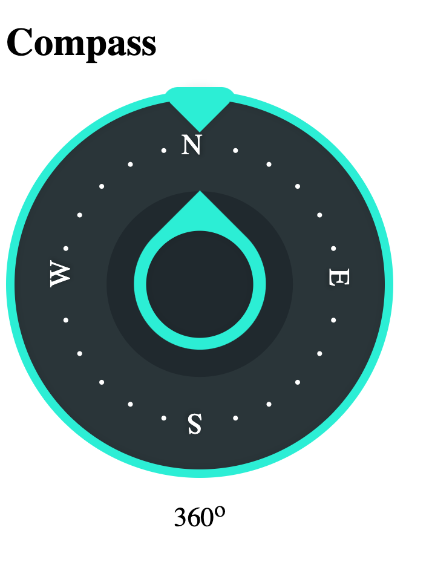

# react-compass-component

[](https://badge.fury.io/js/react-compass-component) 

> A fully functional Compass component for React

<p align="center">
  
</p>


## Installation

The package can be installed via:

- NPM: `npm install react-compass --save`


```js
import React from "react";

import Compass from 'react-compass-component/src'

const App = () =>{
    return (
        <>
        <h1 className="">
            Compass
        </h1>
        <Compass />
        </>

    )
}

export default App
```

## Configuration

The default Compass can be initialised by:

```js
<Compass directionNames={['N', 'NE', 'E', 'SE', 'S', 'SW', 'W', 'NW']}>
```


## Compatibility

Latest compatible versions:

- React "^18.2.0"

## Local Development

TODO

## License

MIT © [Cristian Moyano](https://github.com/cristianemoyano/react-compass-component)